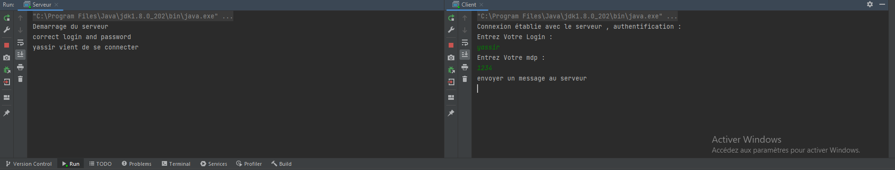
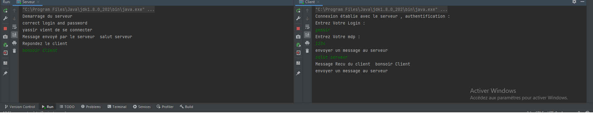
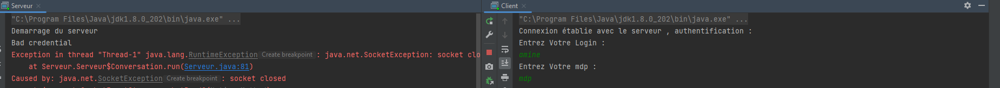

<h1> Compte Rendu TP3 </h1>

 Une fois le serveur demarre , le client demande une connexion  
    le client doit s'authentifier, si le login est le mdp sont correct à ce moment la le client et le serveur peuvent communiquer 
    à noter que username et mdp sont enregistré dans un fichier

 

 Si le mdp ou username ne correspondent pas au même enregistrer dans le fichier MDP.txt le serveur ferme la connexion  

